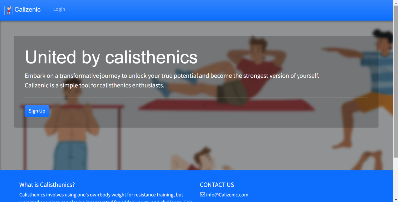

# Calizenic

Calizenic is a web application designed specifically for calisthenics athletes who seek a simple, user-friendly platform to create, log, and track their hybrid workouts. With the growing popularity of bodyweight training and calisthenics around the world, my platform aims to provide a seamless experience for athletes of all levels to efficiently create workouts and monitor their progress.

My application targets calisthenics athletes and fitness enthusiasts who want a dedicated platform to manage their workout routines. Calizenic simplifies the process of creating and logging workouts while providing useful exercises to help users stay motivated.

 

------------

## UX:

Calizenic aims to unite calisthenics athletes seeking a straightforward platform for designing, logging, and tracking their specialized workouts. Catering to a complex and demanding fitness discipline, the platform strives to offer a seamless experience for athletes of all skill levels, from novices to seasoned practitioners. The site's visual elements and overall design focus on delivering an enjoyable user experience, characterized by an appealing and aesthetically pleasing interface.

------------

### Users i would like to target:

- An individual passionate about calisthenics and looking for a platform to create, log, and track workouts.
- Someone seeking a user-friendly interface that simplifies the process of designing personalized calisthenics routines.
- A beginner or advanced calisthenics athlete interested in monitoring their progress and setting new fitness goals.
- A person who values an engaging and aesthetically pleasing digital platform for their workout management.
- Someone interested in connecting with fellow calisthenics enthusiasts and sharing workout tips, progress, and experiences.
- An individual who appreciates the convenience of accessing their calisthenics workout data from any device, at any time.

### My website aims:

- As a calisthenics enthusiast myself, I want to offer a dedicated and easy-to-use workout app that fills the gap in the market, catering specifically to calisthenics athletes like me.
- I want to provide a wide range of workout plans, exercises, and progress tracking tools to support myself and other users in achieving our fitness goals.
- I aim to create a platform that can be customized to meet my unique needs and preferences, ensuring a personalized workout experience that is tailored to my goals and abilities.
- I want to foster a community of calisthenics enthusiasts like myself, where we can share experiences, knowledge, and support each other in our fitness journeys.
- I am committed to continuously improving and expanding the app's features and functionalities based on user feedback, keeping up with evolving fitness trends and user needs.
- I will ensure the app's compatibility and seamless performance across various devices, making it easy for users like myself to access our workout plans and track our progress anytime, anywhere.

## Agile Development Process:

In this project, I utilized a Kanban project board to effectively manage tasks and progress. I organized the tasks using three main labels: Must Have, Should Have, and Could Have. This approach ensured a structured and efficient workflow while prioritizing and implementing the various features. You can view it [here](https://github.com/users/Ian-Garrigan/projects/5/views/1)  

 

### User Stories:

In this project, I created over 20 user stories to outline the different features and requirements. User stories help us understand the software from the end user's perspective and highlight the value each feature provides. These user stories guided the development process, making it easier to prioritize and focus on the most important aspects with each athlete in mind.
 

1. **User Story:** exercise weight selection

- As a user, I can select the exercise weight so that I can maintain purposeful workouts and track progress.

2. **User Story:** workout naming

- As a user, I can input a name for my workout so that it is unique and easy to navigate to.

3. **User Story:** rename workout 

- As a user who has created a custom workout, I want to be able to rename the workout for my current preference.

4. **User Story:** delete a workout 

- As a user, I can delete a workout from my log so that i can correct any mistakes or incorrect information logged.

5. **User Story:** add a workout template

- As a user I want to be able to add a new workout template to my account, so that I can save and reuse the workout in the future.

6. **User Story:** track number of completed workouts 

- As a developer, I can add a feature so that the user can view the number of workouts they have completed in their account.

7. **User Story:** start a workout 

- As a user, I can select a workout from my templates to start so that I know what im doing.

8. **User Story:** finish a workout 

- As a user who has completed a workout, I want to be able to press a "Finish Workout" button so that I have it recorded in my workout log.

9. **User Story:** quick start workout

- As a user, I can quickly start a pre-determined workout routine after log in page so that I save time.

10.	**User Story:** timedate of workout

- As a developer, I can add the time and date of when each workout was completed so that the user can track and plan their routine.

11. **User Story:** note text field

- As a user, I can input a note under a workout in the log so that I can refer to it and read useful information.

12. **User Story:** sign up functionality 

- As a user, i want to easily navigate to the register for an account page and sign up. 

13. **User Story:** account functionalities

- As a developer, I want to implement account/profile creation functionality, so that users can easily create, read, update, and delete their account/profile information.

14.	**User Story:** login capability

-  As a user, I can securely log in to my Calizenic account so that I can access my personal information.

15.	**User Story:** log out capability

- As a user, I can securely log out of my account so that my current session is finished until I revisit.

16.	**User Story:** base.html design 

- As a developer, I want to design a smart & pleasing homepage, so that users have a positive & enjoyable experience when navigating Calizenic.

17.	**User Story:** readme.md

- As a developer, I can create documentation so that other developers can understand the purpose and technical details of the website.

18.	**User Story:** testing.md

- As a developer, I want to create a testing.md file, so that I can document the testing procedures & outcomes.

19. **User Story:** security measure

- As a developer, I need to create an env.py file and add it to .gitignore, so that I can securely deploy the website without exposing sensitive secret keys or information.

20.	**User Story:** pagination for list view

- As a user, i want to be able to easily sort and look through a list of items on the page.

------------

### Wireframes 

During the early stages of this project, I employed wireframes as an essential tool in the design process. Crafting wireframes enabled me to visualize the layout and functionality prior to writing any code or finalizing the visual design, ultimately conserving time and resources by avoiding potential adjustments later. Initially, I began my mornings early on in jotting down basic layouts, which were then refined into more sophisticated wireframes with the help of Balsamiq.

These wireframes served as my rough designs for the project and underwent work throughout its development. The significance of wireframing is in its ability to detect potential design issues early, allowing a more effective and streamlined development journey.

The following are the initial designs that were crafted and modified during the course of the project:

 - [*Home Page*](documentation/wireframes/wireframe-1.png)

- [*User Dashboard*](documentation/wireframes/wireframe-3.png)

- [*User Dashboard 2.0*](documentation/wireframes/wireframe-4.png)

- [*Login/Sign Up Page*](documentation/wireframes/wireframe-2.png)

---

### Project Schema
Planning and designing the database schema early in the development process was crucial for the success of the project. A well-structured database schema enables efficient data organization, storage, and retrieval, which directly impacts the performance and scalability of the application.

By carefully considering the schema design upfront, I was able to identify the relationships between different entities, as well as the required data types and constraints. This understanding allowed me to streamline the development process by reducing the likelihood of encountering data-related issues later on, such as data inconsistency or redundancy.

This was my early attempt of creating the schema with the help of an ERD diagram: 
 

---

## Features 

The features on the website help make it easier and more enjoyable for users. The navigation bar helps people find what they need quickly, while the jumbotron and call-to-action button on the landing page grab attention and encourage users to get started.

The responsive footer gives users access to important links, and the simple login and sign-up forms make it easy for people to join or sign in. The edit log feature lets users customize their workouts, and the view workouts list with pagination keeps everything organized and easy to browse.

All of these features work together to create a great user experience, making people want to use the site and tell their friends about it. Here are some of the elements of my site im most proud of: 

 

### Landing page
The landing page provides a visually appealing introduction to the site, with clear messaging and a call-to-action button that encourages users to explore further.
 

### jumbotron
The jumbotron is a large, attention-grabbing element that highlights important information or promotions, helping to draw users into the site's content.
 

### dropend-bar
The dropend bar offers an easy-to-use navigation system, allowing users to find the features they need quickly and efficiently.
 

### edit-log
The edit log page enables users to customize their workout logs, providing flexibility and personalization to their fitness journey.
 

### login/sign in
The login and sign-in pages offer simple and straightforward forms for users to access their accounts or join the platform.
 

### log-entry 
The log entry page allows users to input their workout data, helping them track their progress and stay motivated.
 

### footer
The footer provides quick access to essential links and information, while also maintaining a clean and organized layout.
 

### nav-bar
The navigation bar is a user-friendly menu that helps users navigate the site easily and find what they're looking for.
 

### mobile-device-response
The mobile-device shot view demonstrates that the site is fully responsive and adapts well to different screen sizes, ensuring a positive experience for users on any device.
 

 

# Web Design 

My design philosophy is centered around simplicity, user-friendliness, and creating a visually appealing experience. I believe that a well-designed website should not only be easy to navigate but also leave a lasting impression on its users. With this in mind, I chose a color palette and design elements that work together to achieve these goals.

The color choices for the website include blue, light blue, deep red, and a white background. **Blue** is known to evoke feelings of trust, stability, and calmness, making it an ideal choice for a fitness platform like this. **Light blue** adds a touch of freshness and energy, while the **deep red** provides contrast and attracts attention to important elements on the site. The **white** background creates a clean and minimalistic look, ensuring that the content remains the main focus.

To complement the color scheme, I opted for *minimalistic* shapes and a vector-style background image. These design elements contribute to the overall visual harmony and make the website more engaging without being overwhelming or distracting. The combination of simple shapes and vibrant colors creates a modern and inviting atmosphere, encouraging users to explore the platform and engage with the content.

Ultimately, the goal of the design is to create a long-lasting impression on users, making them feel comfortable and motivated to use the platform for their fitness journey. By combining this color palette, minimalistic shapes, and an eye-catching background, I believe that the design is both enjoyable and functional.

## Typography 

For the typography choices on Calizenic, I selected KaushanScript-Regular and Source Sans Pro to create a visually appealing and easy-to-read experience for users.

**KaushanScript-Regular** is a stylish and modern script font that adds a touch of elegance and personality to the platform. I chose this font for headings and important elements because it captures attention and sets the tone for the site's overall design aesthetic.

On the other hand, **Source Sans Pro** is a versatile and clean sans-serif font that provides excellent legibility for body text and other content. Its simplicity and clarity make it an ideal choice for the majority of the text on the website, ensuring that users can easily read and comprehend the information provided.

By combining the distinctive and eye-catching KaushanScript-Regular with the readability and functionality of Source Sans Pro, I aimed to create a harmonious balance.

## Technologies used

#### Languages:

- HTMl5

- CSS3

- Python 

- Javascript

#### Frameworks & Tools

- Django

- Bootstrap

- Crispy-forms

- Allauth 

- Cloudinary

- Postgresql

- Git 

- Heroku 

- Github 

- Balsamiq wireframer

- Font Awesome & Font Squirrel 

## Credits 

I would like to thank my mentor [Tim Nelson](https://github.com/TravelTimN). Your insights and advice have not only contributed to the success of this project but also helped me gain a deeper understanding of the field. I am truly grateful for the time and effort you have invested in mentoring me. I would like to wish you all the best in your future in Germany. Everybody at Code Institute will miss you greatly! 

