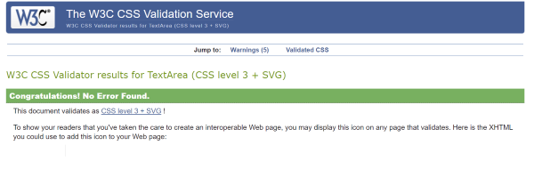
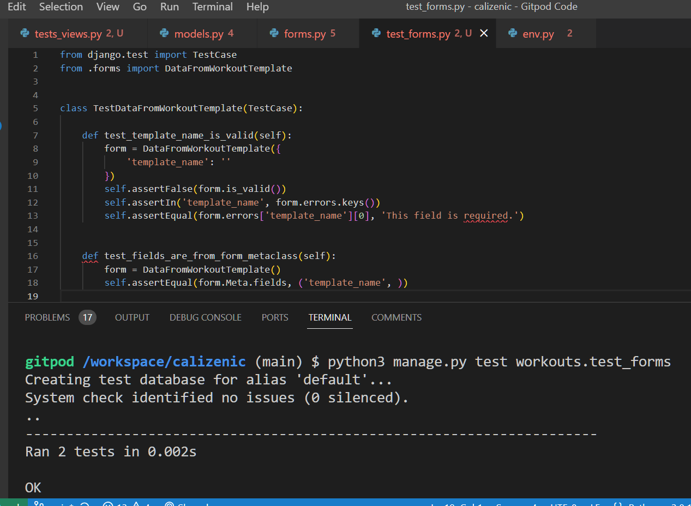
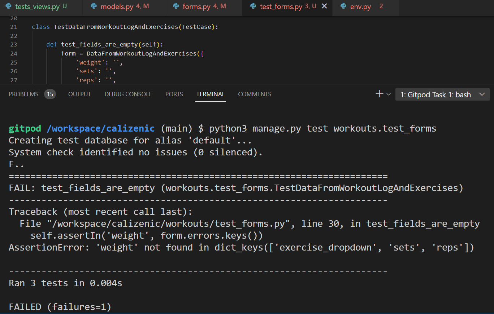
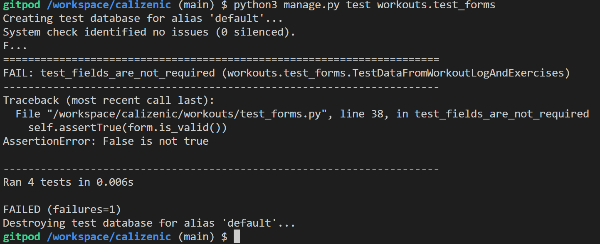
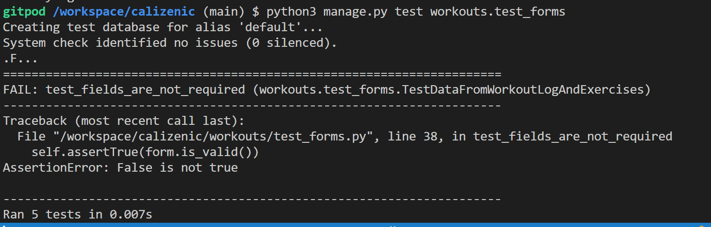
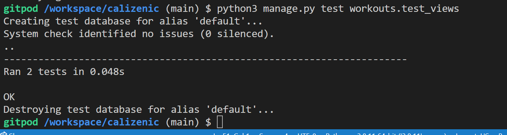
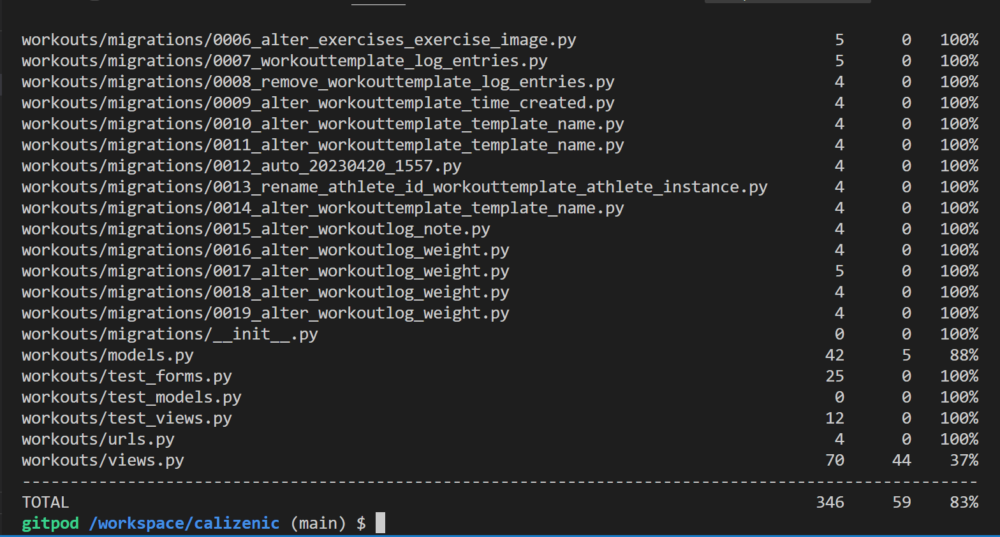

## Testing 

Css Validator: 

 

### Automated Testing

Details of test_forms.py:

  

  

  

   

#### test_views.py
  

   

  ### Coverage Report
  

## Manual Testing 

This table shows all the manual testing done for the website. I show whether it worked as expected or failed to reach expectation in testing.

### Features

Feature Tested | Expected Result | Actual Result | Pass/Fail
---------------|-----------------|---------------|----------
Mobile linear layout | Layout becomes linear on mobile | expected | Pass
Buttons change colour on hover | Buttons change colour on hover | expected | Pass
Nav bar responsive | Navbar becomes hamburger menu on resizing | expected | Pass
Messages are displayed for user feedback | All messages shown expected | expected | Pass
Sign up button on home page for users | button redirects to Sign Up Page | expected | Pass
Button on home page for users logged in | button for user dashboard | not expected | Fail
User redirected to dashboard if return button is clicked | user-dashboard.html renders | expected | Pass
View workout templates list | templates are show in date time order |  expected | Pass
Create workout template form | ability to create workout template  |  expected | Pass
Edit workout template form | ability to edit workout template  |  expected | Pass
Delete workout template form | ability to delete workout template  |  expected | Pass

  
